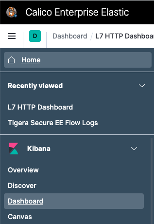

# 9 Observability - Dashboards

In this lab, we will enable application layer data in flow logs.

Steps: \
9.1 Patch the FelixConfiguration resource, so we enabled l7 flow collection \
9.2 Configure an ApplicationLayer resource \
9.3 Select the traffic for L7 log collection \
9.4 Check the DNS Dashboard in Kibana


## 9.1 Configure Felix for log data collection

Application layer data extends the default Calico flow logs adding layer 7 contextual information about the request. Calico enterprise provides extensive logging and observability featureset that Calico Enterprise uses in many functions, including threat defense, anomaly detection, machine learning, compliance reporting, service graph, policy recommendations, and many other functions. Logs can be also forwarded to your external SIEM for long term retention and compliance.

```
kubectl patch felixconfiguration default --type='merge' -p '{"spec":{"policySyncPathPrefix":"/var/run/nodeagent"}}'
```

## 9.2 Configure an ApplicationLayer resource

Calico uses Envoy as the medium for extracting application layer contextual information. The ApplicationLayer resource controls several log collection parameters:

```
kubectl create -f - << EOF
apiVersion: operator.tigera.io/v1
kind: ApplicationLayer
metadata:
  name: tigera-secure
spec:
  logCollection:
    collectLogs: Enabled
    logIntervalSeconds: 5
    logRequestsPerInterval: -1
EOF
```

## 9.3. Select the traffic for L7 log collection

Next enable yaobank to use Envoy. This will give us layer 7 visibility into micro-services communication, for that, we annotate the service we accessed on a previous lab from our browser:

```
kubectl annotate svc customer -n yaobank projectcalico.org/l7-logging=true
```

## 9.4. Verify The Application Level Dashboard

We need to retrieve the password for kibana you wrote down in previous labs. If you forgot to do so then execute the command below:

```
kubectl -n tigera-elasticsearch get secret tigera-secure-es-elastic-user -o go-template='{{.data.elastic | base64decode}}' && echo
```

Before Checking the Dashboards, generate some http traffic for our yaobank application, for that connect with your browser to the ingress service of yaobank, and refresh the page several times:

```
https://yaobank.hdp.lynx.tigera.ca/
```

Access kibana from the left tool bar with the icon . The default username is `elastic`.

Now select the Dashboards as indicated in the figure below, and then L7 HTTP Dashboard:



There you will see the Application level Dashboard for the yaobank application


